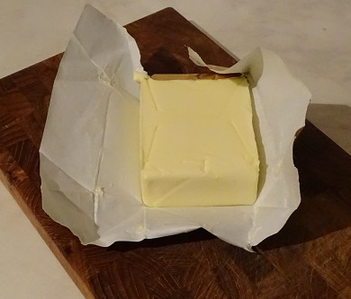
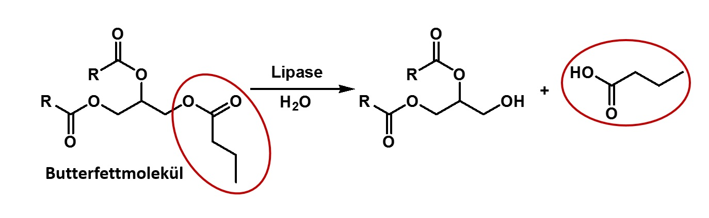

# Dein Aktivitätstest

Nachdem Du eine Lipase im Handel (erhältlich als Lipase oder Verdauungsenzym als Nahrungsergänzungsmittel im Drogeriemarkt) erworben hast, muss diese qualitativ auf ihre Aktivität überprüft werden,
denn davon hängt der Erfolg nachfolgender biotechnologischer Schritte ab.
Da die Lipase ein fettspaltendes Enzym ist, bedienen wir uns eines einfachen Tests,
nämlich der Spaltung von Triglyceriden (Fettmolekülen) der Butter.
Hierbei sollte sich bei einer funktionsfähigen Lipase der charakteristische Buttersäuregeruch
(erinnert an Schweißfüße oder an ranzige Butter) bilden und zeigt somit die Aktivität der gekauften Lipase an.

## Deine benötigten Materialien:

* Butter
* Wasser
* Haushaltshandschuhe
* Lipase aus dem Drogeriemarkt oder dem Internetshop für Ernährungszusätze

## Versuchsbeschreibung:

**Achtung! Handschuhe tragen!** Eine Messerspitze Lipasepulver aus der Verpackung (evtl. Kapsel) nehmen
und mit ein paar Tropfen Wasser auf der Handfläche sanft vermischen.
Eine Messerspitze Butter zum wässrigen Lipasegemisch hinzufügen und mit den durch die Hansschuhe geschützten Fingerspitzer vermischen.
Nach wenigen Sekunden sollte ein unangenehm stechender Geruch wahrnehmbar sein.
Hierzu vorsichtig an dem Gemisch riechen. Falls das gekaufte Enzymgemisch Lipaseaktivität aufweist,
wird der Test erfolgreich verlaufen und der Buttersäuregeruch auftreten. Die folgende Reaktionsgleichung beschreibt das Geschehen.

Hierbei ist das Buttersäuremolekül als Bestandteil des Triglycerids (Fettmolekül)
der Butter auf der linken Seite des Pfeils im Startmaterial und als freie Säure
auf der rechten Seite des Pfeils als rot umrandetes Produkt gezeigt. Als Bestandteil im Fettmolekül
ist die Buttersäure nicht wahrnehmbar, jedoch als freie Säure direkt als
charakteristisch stechend riechend zu empfinden.

Bei dem hier beschriebenen Aktivitätstest wird die Rückreaktion der Veresterung,
nämlich die Hydrolyse des Fettsäureesters mit Wasser unter Bildung von Buttersäure
und abgespaltenem Alkohol ausgenutzt.
