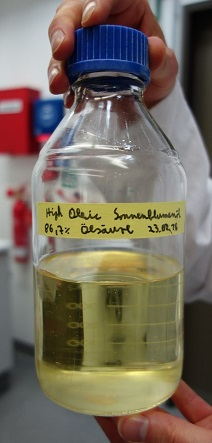
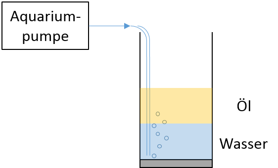

# Dein eigener Blasensäulenreaktor

Hier soll es darum gehen mittels weniger Utensilien eine eigene Blasensäule aufzubauen.
In diesem Versuch soll ein grundlegendes Verständnis für den Betrieb eines Blasensäulenreaktors vermittelt werden.
Aus pragmatischen Gründen wird hier nicht die Fettsäureestersynthese untersucht,
welche die Inhaltsstoffe für eine Hautcreme liefert,
sondern die bereits beim Aktivitätstest vorgestellte Hydrolyse-Reaktion eines Fettsäureesters.
Deshalb handelt es sich bei dem Reaktionsgemisch auch um zwei Phasen, eine nicht wassermischbare Öl-Phase (Fettsäureester) und einer Wasserphase.
Zu der Durchführung des Experimentes kannst Du Dir unten auf der Seite ein Video ansehen.

## Deine benötigten Materialien:

* Aquariumpumpe (schon für einige Euro in einem Zoofachgeschäft)
* Klares Glas mit geraden Wänden (z. B. Kölschglas) 200 – 400 mL
* Strohhalme (länger als die Höhe des Glases sein sollten und idealerweise einen knickbaren Bereich besitzen)
* Schläuche
* Öl (z.B. Sonnenblumenöl, Rapsöl oder Olivenöl)
* Wasser
* Lipase bzw. Enzymgemisch mit Lipase aus dem Drogeriemarkt oder dem Internetshop

## Versuchsbeschreibung:

Zuerst wird die Aquariumpumpe mit Hilfe eines Schlauchs mit einem Strohhalm fest verbunden und auf Dichtigkeit geprüft.
Des Weiteren ist es sinnvoll, dass Du in einem Vorversuch zuerst nur mit den beiden Flüssigkeiten und ohne das
Enzym die Luftförderleistung der Pumpe überprüfst, um das eventuelle Überschwappen
des Öl-Wasser-Gemisches zu vermeiden, indem die Flüssigkeitsmenge angepasst wird.
Die Durchmischung wird durch das Anschalten der Pumpe begonnen.
Durch verschiedene Versuchsvariationen kann die Durchmischung und die Größe der Blasen optimiert werden. Hierzu kannst Du Dir das erste Video ansehen.

Wenn Du die Vorversuche abgeschlossen hast, kannst Du die Lipase bzw. das Enzymgemisch mit Lipase in das Glas geben.
Falls das Pulver in Kapseln gekauft wurde, die Kapseln aufbrechen und nur das Pulver benutzen.
Ein Viertel des Glasvolumens mit Wasser füllen und kurz schwenken, so dass das Pulver gelöst oder gut suspendiert vorliegt.
Danach ein zweites Viertel des Glasvolumens an Öl dazugeben und den an die Aquariumpumpe
angeschlossenen Strohhalm tief an den Boden anbringen und dort fixieren.

## Videos zur Versuchsdurchführung

Wir haben die Experimente mit den einfachen Utensilien auch schon selber im Labor durchgeführt. Hier kannst Du Dir die aufgenommenen Videos ansehen.

#### Experiment 1 zur Blasengröße und -verteilung:

  <iframe src="https://podcampus.de/nodes/wLrVx/embed?vq=res0480" width="200" height="480" frameborder="0" seamless allowfullscreen></iframe>

Videoverweis: <a href="https://podcampus.de/nodes/wLrVx/embed?vq=res0480" target="_blank">https://podcampus.de/nodes/wLrVx/embed?vq=res0480</a>

#### Experiment 2 zur Vermischung von zwei Phasen und Hydrolyse eines Esters mittels des Enzyms Lipase:

  <iframe src="https://podcampus.de/nodes/pBZel/embed?vq=res0480" width="200" height="480" frameborder="0" seamless allowfullscreen></iframe>

Videoverweis: <a href="https://podcampus.de/nodes/pBZel/embed?vq=res0480" target="_blank">https://podcampus.de/nodes/pBZel/embed?vq=res0480</a>

## Arbeitsauftrag:

Hier werden nun verschiedene Fragen gestellt oder Versuchsdurchführungen beschrieben, die die Experimentierneugier wecken soll.
Deine eigene Erfahrungen mit Deinem Blasensäulenreaktor kannst Du mit anderen Nutzer/innen teilen, nutze dazu das Forum „Eigene Erfahrungen mit dem Blasensäulenreaktor“ (siehe [unten](#forum)).

* Die Durchmsichung ist Abhängig von dem Innendurchmesser des Strohhalms und der Luft-Pumprate. Experimentiere mit Strohalmen mit unterschiedlichem Innendurchmesser und falls du eine regelbare Aquariumpumpe hast, reduziere die Pumpleistung.

* Experimentiere mit verschiedenen Materialien am Luftauslass des Stohhlams herum um die Größe der Blasen zu variieren.

* Um die Effektivität der Durchmischung der beiden Phasen messbar zumachen, geben Deinem Versuchsaufbau einen bestimmten Zeitraum (2 Mintuen) um die beiden Phasen zu Durchmischen und stoppe dann die Aquariumpumpe. Wie lange dauert es bis die beiden Pahsen wieder klar von einander getrennt sind? Erkennst Du einen Zusammenhang?

* Wie sehen nun Deine Erfahrungen und Ergebnisse zum Experimentieren mit Deinem eigenen Blasensäulenreaktor aus?

## Eigene Erfahrungen mit dem Blasensäulenreaktor {#forum}

