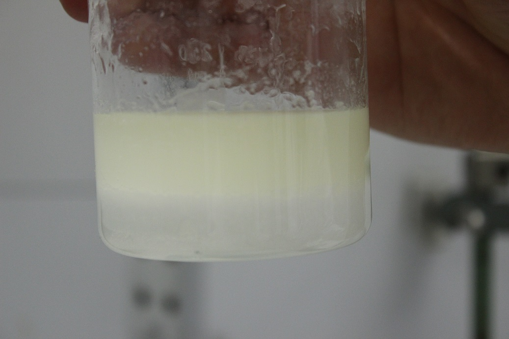
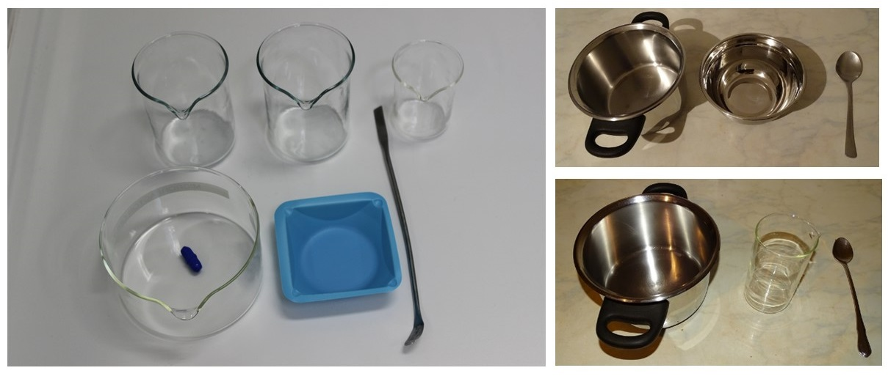
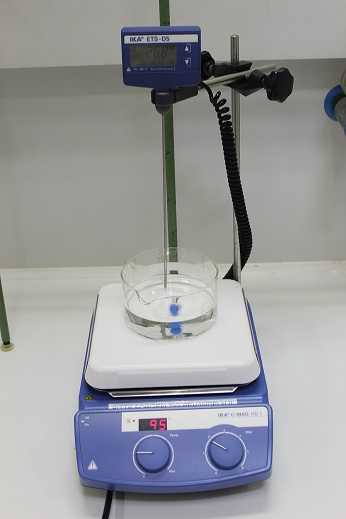
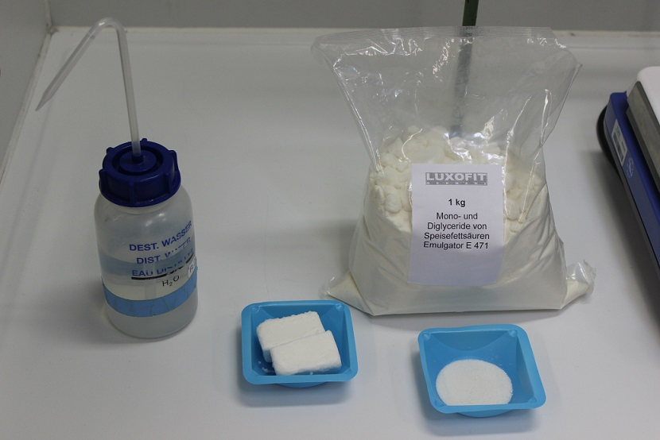
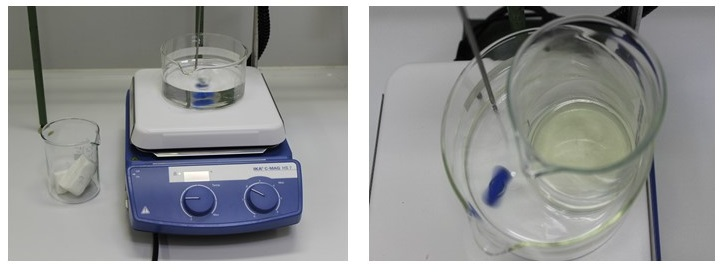
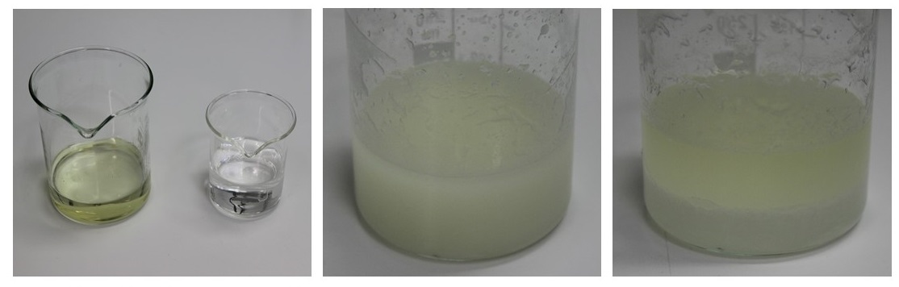

# Deine Handcreme

Da es sich bei einer Handcreme lediglich um eine Öl-Wasser- beziehungsweise Wasser-Öl-Emulsion 
handelt, wäre es vollkommen ausreichend Öl mit Wasser zu emulgieren. Dies wäre schon damit erledigt, 
dass man die beiden Komponenten miteinander schüttelt. Allerdings wird man schnell feststellen, 
dass sich Öl und Wasser wieder entmischen (siehe Abbildung 1).

Die Trübung der beiden flüssigen Phasen in Abbildung 1 entsteht durch kleinste 
Tröpfchen Wasser im Öl und kleinste Tröpfchen Öl im Wasser. Eigentlich ist sowohl 
das Öl als auch das Wasser klar und durchscheinend. Eine Emulsion hingegen erscheint meistens weiß. 
Um das in der Abbildung 1 gezeigte Zweiphasensystem in eine stabile Emulsion umzusetzen, wird ein Emulgator benutzt. 
Es kann ein beliebiger Emulgator hierfür verwendet werde. Es müssen allerdings 
die jeweiligen Bedingungen eingehalten werden, bei denen der gewählte Emulgator seine 
Eigenschaften am besten entfalten kann. Wir werden [Mono- und Diglyceride von Speisefettsäure (MDSF)](./MoDiGlyceride.md) 
als Emulgator für die Herstellung unserer Handcreme verwenden. 
Hierzu am besten die MDSF in Lebensmittelqualität verwenden, da es der beste Standard für unsere Zwecke ist. 
Wir werden lediglich noch Wasser, ein beliebiges Fett oder Öl und eventuell Glycerin verwenden. 
Hierbei stellen wir eine Creme mit und eine ohne Glycerin her und vergleichen beide hinsichtlich der Langzeitlagerung.

## Deine benötigten Materialien und Zutaten:

* Hitzefeste Gläser
* Waage
* Spatel oder Löffel
* Messbecher
* Wasserbad (Topf mit Wasser)
* Herd
* evtl. Thermometer
* Destilliertes Wasser
* Öl oder Fett (z.B. Kokosfett)
* Mono- und Diglyceride von Speisefettsäuren (Kann als Emulgator E 471 im Internet oder Lebensmittelzusatzhandel gekauft werden.)
* evtl. Glycerin

In Abbildung 2 ist gezeigt, was wir im Labor verwenden und eventuelle Entsprechungen für den heimischen Versuchsaufbau. 
Unter [Dein Labor](./labor.md) kannst Du weitere Entsprechungen von Labor und Küche finden.

## Versuchsbeschreibung:

In den größeren Bechergläsern werden wir das Fett erhitzen, den Emulgator darin auflösen 
und schließlich das entstandene Gemisch mit Wasser vermischen. Das kleinere Becherglas 
eignet sich zum Abmessen des benötigten Wasservolumens, wobei Wasser auch abgewogen werden kann. 
Die größere Glasschale, eigentlich eine Kristallisierschale, werden wir als Behälter 
für ein Wasserbad benutzen. Zusätzlich benutzen wir einen Rührfisch zum Durchmischen des Wassers im Wasserbad,
um eine effizientere Wärmeverteilung zu gewährleisten. In der Wägeschale wird der Emulgator in fester Form 
abgewogen. Zum Heizen werden wir den vorher 
schon erwähnten Magnetrührer mit Heizfunktion verwenden (Abbildung 3).

Zuerst wird eine definierte Menge (z. B. 50 g) Fett oder Öl auf der Waage im Becher 
oder Glas abgewogen und ins Wasserbad gestellt. Die Fettkomponente wird im Wasserbad auf eine Temperatur von 65° C erhitzt. 
Währenddessen wird der Emulgator (5% bezogen auf die Fettkomponente, 2.5 g) abgewogen 
und zur Fettkomponente zugegeben. In ein zweites Glas werden 50 mL (g) destilliertes Wasser gefüllt 
und ebenfalls ins Wasserbad gestellt. Nachdem sich der Emulgator im Öl gelöst hat, 
kann das Anmischen der Creme beginnen, indem das Öl und das Wasser in unterschiedlichen 
Verhältnissen zueinander in einem dritten Glas zusammengegeben und vermischt werden. 
Das Abmessen von Öl und Wasser kann mit einem Esslöffel gemacht werden und das Vermischen mit einem Teelöffelstiel. 
Es muss solange gemischt werden bis das Gemisch eine bleibende cremige Konsistenz angenommen hat. 
Die Verhältnisse von Öl zu Wasser können der Reihe nach ausprobiert werden (z. B. 1:4, 1:2, 1:1, 2:1, 4:1). 
Je nach Wasseraufnahmevermögen der Emulsion bedingt durch den Emulgator wird bei unterschiedlichen Verhältnissen von Öl zu Wasser 
eine unterschiedliche Konsistenz erzielt. Dokumentiert und vergleicht die Ergebnisse.

Wir haben die Beispielmengen von 50 g Fett, 50 g Wasser und 2.5 g Emulgator 
eingesetzt und Kokosfett bzw. Kokosöl verwendet (Abbildung 4). 
In der folgenden Abbildung 5 ist das Kokosöl einmal in seiner festen Form bei 
Raumtemperatur und in der flüssigen Form bei ca. 50 °C gezeigt.

Als nächstes wurden 2.5 g Emulgator im heißen Kokosöl bei ca. 65 °C gelöst. 
Auch die 50 g Wasser wurden auf ca. 65 °C erwärmt (Abbildung 5). 
Im nächsten Schritt wurde das Wasser komplett zum öligen Gemisch gegeben und 
sofort mit Hilfe des Spatels für mindestens eine Minute energisch vermischt.

 
In der Abbildung 6 ist das Ergebnis unseres Versuches zur Herstellung einer Emulsion gezeigt, 
die als eine Creme verwendet werden kann. Es ist klar zu erkennen, 
dass das Endprodukt keine cremige Konsistenz aufweist und somit die Emulsion nicht stabil war, 
sondern sich nach einer Minute Standzeit die beiden Komponenten Öl und Wasser wieder getrennt hat.

Dieses Verhalten hat einen Grund, den Du herausfinden sollst. Somit wollen wir alle Experimentierfreudigen zum Mitmachen einladen. 

## Arbeitsauftrag:

Hier werden nun verschiedene Fragen gestellt oder Versuchsdurchführungen beschrieben, die die Experimentierneugier wecken soll. 
Deine eigene Erfahrungen mit der Herstellung Deiner Handcreme kannst Du mit anderen Nutzer/innen teilen, 
nutze dazu das Forum (siehe unten) „Eigene Erfahrungen mit der Herstellung der Handcreme“.

* Probiere verschiedene Verhältnisse (z. B. 1:4, 1:2, 1:1, 2:1, 4:1) von Öl zu Wasser aus.

* Frage: Was ist der Grund für die Entmischung bzw. die instabile Emulsion?

* Wie sehen Deine Ergebnisse und Erfahrungen mit dem Experiment zur Herstellung Deiner eigenen Handcreme aus?

## Eigene Erfahrungen mit der Herstellung der Handcreme

