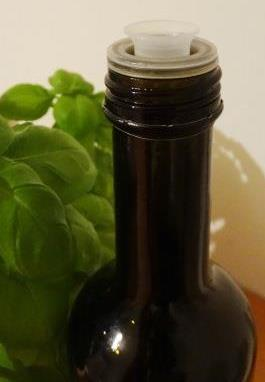
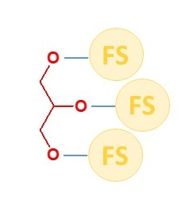

# Fette und Öle

Fette und Öle begegnen uns bei unserer täglichen Ernährung und gehören zu den Grundnährstoffen des Menschen.
Öl ist zum Beispiel in Salatdressing (Sonnenblumenöl) enthalten, oder Fett wird beim Braten mit Kokosfett verwendet, auch Butter besitzt Fettanteil.
Mittels Internetrecherche bekommt man schon einen ersten, guten Überblick darüber, was Fette und Öle sind und wofür sie benötigt werden.
Naturprodukte, die als Lebensmittel erhebliche Bedeutung besitzen, sind beispielsweise Kokosfett, Olivenöl, Palmöl, Rapsöl und Sonnenblumenöl.

#### Wie sind Fette und Öle chemisch aufgebaut?

Wir gehen kurz auf ihre chemische Struktur ein,
weil es im Verlauf des Kurses von besonderer Bedeutung für uns sein wird.
Im folgenden Bild (Abbildung 2) ist schematisch ein Fett- bzw. Ölmolekül gezeigt.

Alle Fette und Öle besitzen das gleiche Grundgerüst, zu dem das [Glycerin](./glycerin.md) (in Abb. 1 in Rot hervorgehoben)
und die Fettsäurereste (gelbe Kugeln, **F**ett**s**äure (FS) Rest) gehören. Die blaue Bindung repräsentiert die Esterbindung, und diese
gibt es insgesamt dreimal in jedem Fett- oder Ölmolekül. Somit sind Fette und Öle dreifache Ester des Glycerins
oder auch Triglyceride genannt. In späteren Unterkapiteln kommen wir darauf zu sprechen wie die [Fettsäuren](./speisefettsaeure.md) aussehen.
Kommen wir nun zu der Frage, warum zwischen Fetten und Ölen unterschieden wird, wenn sie doch
chemisch vom Prinzip gleichartig sind. Es ist ganz einfach die Übereinkunft bei Raumtemperatur feste
Triglyceride als Fette und entsprechend flüssige Triglyceride als Öle zu bezeichnen. Manchmal können je nach Wohnort
und Jahreszeit ziemliche Unterschiede in der Raumtemperatur auftreten oder auch die
Triglyceride einen Schmelzpunkt bei knapp unter oder über der Raumtemperatur haben.
Ein gutes Beispiel dafür ist das Kokosfett oder –öl, dessen Schmelzpunkt zwischen 23-26° C liegt.
Was beeinflusst aber, ob ein Fett oder Öl bei Raumtemperatur flüssig oder fest ist? Das klären wir später im Abschnitt [Fettsäuren](./speisefettsaeure.md).

Eine Creme kann als eine Öl-in-Wasser (O/W)- oder einer Wasser-in-Öl (W/O)-Mischung (Emulsion) bezeichnet werden.
Ausgehend von dieser Vorstellung können die Inhaltsstoffe auf eine kleine Zahl
reduziert werden, und damit würden ölige beziehungsweise fettige Bestandteile zu den Hauptinhaltsstoffen zählen.

#### Was sind das aber für Komponenten? Und was ist ihre Funktion in der Creme?

Gerade im Winter sollte man fettreiche Creme verwenden, wobei man dann von einer Wasser-in-Öl-Emulsion oder auf Wasser-in-Öl-Basis spricht.
Die auch als besonders lipidhaltige Creme bezeichneten Cremes bilden mit dem höheren Anteil an
Fett oder Öl einen Schutzfilm auf der Haut und isolieren gegen die Kälte, hierdurch trocknet die Haut
nicht so schnell aus und wird weniger spröde oder rissig. Ebenso haben der Öl- oder Fettanteil in der
Creme die Aufgabe eine ausgewogene Emulsion zu gewährleisten, da ansonst die Creme mit einem hohen Wasseranteil
(Öl-in-Wasser) zu flüssig wären. Ebenso gibt es aber auch Hautöl, das kaum Wasser enthält und
direkt auf die feuchte Haut nach dem Duschen oder Baden aufgetragen wird.
