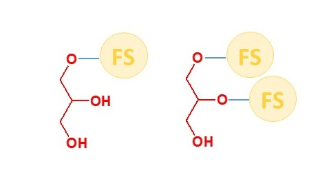

# Mono- und Diglyceride von Speisefettsäuren

Diesen Inhaltsstoff findet man in sehr vielen Produkten im Lebensmittelsupermarkt.

#### Was sind aber die Mono- und Diglyceride von Speisefettsäuren und warum sind diese so oft in Lebensmitteln vorzufinden?

Wenn wir uns an die Beschreibung zu den Fetten und Ölen zurückerinnern, dann fällt auf,
dass einzelne Wortbestandteile uns bekannt vorkommen. Glyceride und Fettsäuren zum Beispiel.
Wir haben Öle und Fette als Triglyceride bezeichnet und gesagt, dass diese drei Fettsäurereste besitzen.
Da die Vorsilbe "tri" für eine bestimmte Anzahl steht, nämlich drei, und "mono"
und "di" für ein oder zwei steht, lässt sich somit ableiten, dass die Mono- bzw.
Diglyceride entweder nur einen oder zwei Fettsäurereste besitzen.
In der folgenden Abbildung ist die schematische Struktur von diesen Molekülen gezeigt.

Bei den beiden Molekülen in Abbildung 1 handelt es sich um einfache bzw.
zweifache Ester des Glycerins. Das Glycerinmolekül selbst wird separat vorgestellt.
Was ist nun das Besondere an diesen beiden Molekülen, denn im Prinzip unterscheiden sich diese
von Fettmolekülen anscheinend nur geringfügig. Hierbei sind entweder ein oder zwei
Fettsäurereste durch ein "H", das für ein Wasserstoffatom steht, ersetzt.
Jedoch bringt diese Veränderung schon den gravierenden Unterschied. Diese "OH-Gruppen",
in der Chemie auch als Hydroxylgruppen bezeichnet, wirken sehr anziehend auf Wasser.
Die übrigen gelben Fettsäurekugeln sind jedoch für Fette und Öle attraktiv.
Somit sind zwei Funktionen in einem Molekül vereint: Fett und Wasser anzuziehen.
Diese Eigenschaft wird dazu ausgenutzt um Öle bzw. Fette mit Wasser zu vermischen.
Hierbei handelt es sich nicht um eine Lösung, wie man diese von Wasser-Alkoholgemischen kennt,
sondern um eine Emulsion. Dabei sind kleinste Tröpfchen Wasser mit kleinsten Tröpfchen Öl vermischt,
man nennt es auch "emulgiert". Und damit solche Emulsionen stabil bleiben,
das heißt, dass das Wasser und das Öl sich nicht mehr voneinander trennen, werden Emulgatoren
wie die Mono- und Diglyceride von Speisefettsäuren beigemischt. Daher ist es auch nicht verwunderlich,
dass sie in Lebensmitteln aller Art als Inhaltsstoff enthalten sind, wo ebenfalls auch Fette und Öle zusammen mit
Wasser enthalten sind. Dort erfüllen die Mono- und Diglyceride von Speisefettsäuren die Funktion
des Emulgators und halten Fette und Wasser zusammen. Diese Eigenschaft wird aber auch
im kosmetischen Bereich zur Herstellung von Cremes ausgenutzt,
womit wir uns im Folgenden beschäftigen werden.
