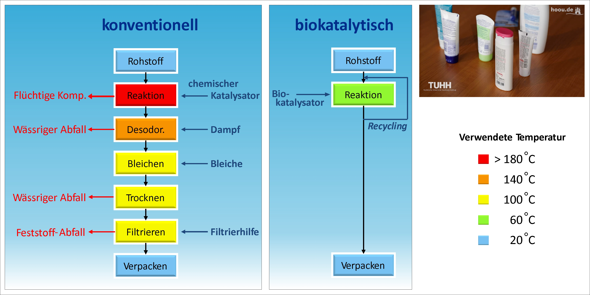

# Biotechnologische Herstellungsverfahren von Inhaltsstoffen in der Industrie und Forschung

Wie bereits bei den Inhaltsstoffen aufgeführt und in der Einführung erwähnt sind Fettsäureester in Hautcremes enthalten um das Einziehverhalten zu verbessern.
Die Veresterung kann durch eine klassische chemische Reaktion, z. B. unter der Verwendung von Säure, als Katalysator vollzogen werden.

## Vergleich von konventionellem und biokatalytischem Herstellungsverfahren

In den klassischen chemischen Produktionsverfahren werden häufig Lösungsmittel verwendet, höhere Temperaturen benötigt und es fallen häufig Produktionsabfälle an.
In der Abbildung 1 werden der konventionelle und der biokatalytische Produktionsprozess verglichen. Hierbei ist deutlich zu erkennen,
dass bei der konventionellen Herstellung eine deutlich größere Anzahl von Schritten benötigt wird und auch die Temperaturen,
welche benötigt werden, in mehreren Schritten höher liegen als im biokatalytischen Prozess.
Somit wird beim konventionellen Prozess viel mehr Energie benötigt, um die Reaktion zu erwärmen.
Aufgrund der höheren Temperatur im Syntheseschritt werden mehr Nebenprodukte gebildet,
die in den folgenden Aufarbeitungsschritten abgetrennt werden müssen.
Für diese zusätzlichen Aufarbeitungsschritte werden neue Einsatzstoffe benötigt
(Dampf, Bleiche, Filtrierhilfe), die wiederum abgetrennt werden müssen und wodurch die produktspezifische Abfallmenge zunimmt.
Aus Sichtweise eines möglichst kosteneffizienten und ökologischen Herstellungsverfahrens besitzt der biokatalytische Weg daher klare Vorteile.

 Vergleich des konventionellen (chemokatalytischen) und biokatalytischen Herstellungsverfahrens. Abbildung modifiziert nach Referenz[^1]

Sowohl das konventionelle als auch das biokatalytische Herstellungsverfahren werden
ohne Lösungsmittel in Reinsubstanz durchgeführt, d. h.,
es werden die reinen Rohstoffe miteinander vermischt und nur der jeweilige Katalysator hinzu gesetzt.

Fettsäureester werden in beiden beschriebenen Herstellungsverfahren durch Veresterung einer Fettsäure mit einem Alkohol gewonnen.
Diese Reaktion wird durch einen Katalysator beschleunigt, welcher dem Reaktionsgemisch zugesetzt wird.
Das chemische und das biokatalytische Verfahren unterscheiden sich vor allem maßgeblich in der Reaktionstemperatur.
Aufgrund der niedrigeren Reaktionstemperatur im biokatalytischen Verfahren wird nicht Erengie gespart,
es werden auch weniger Nebenprodukte gebildet und dadurch vier Aufarbeitungsschritte eingespart.
In der Veresterungsreaktion wird neben dem Zielprodukt des Fettsäureesters als zweites Produkt Wasser gebildet.
Hierbei handelt es sich um eine sog. „Gleichgewichtsreaktion“, wo die Ausgangsstoffe auf der linken Seite mit den
Produkten auf der rechten Seite im Gleichgewicht liegen. Um maximale Umsätze in der Reaktion zu erzielen,
muss deshalb das Reaktionsgleichgewicht auf die Produktseite verschoben werden.
Dieses erfolgt durch eine in situ, d. h. gleichzeitig während der Reaktion laufenden, Wasserabtrennung.

Die Durchführung der biokatalytischen Veresterungsreaktion im Blasensäulenreaktor in dem unten gezeigten Video bietet zwei große Vorteile:

1.	Hoher Energieeintrag zur Vermischung der Ausgangsstoffe mit dem Katalysator
2.	In situ Abtrennung des gebildeten Reaktionswassers mit der eingeblasenen Luft.

## Forschungsexperiment zur biokatalytischen Veresterung im Blasensäulenreaktor

<iframe src="https://podcampus.de/nodes/RJKlG/embed?vq=res0480" width="854" height="480" frameborder="0" seamless allowfullscreen></iframe>

Videoverweis: <a href="https://podcampus.de/nodes/RJKlG" target="_blank">https://podcampus.de/nodes/RJKlG</a>

Falls Du Dich mit der Veresterung im Blasensäulenreaktor und der zugrundeliegenden
Reaktion und Theorien näher auseinandersetzen möchtest, dann schaue Dir doch einfach das
Unterkapitel [Blasensäulenreaktor](./studierende/emulsion-im-blasenreaktor.md) an.
Dort findest Du ein ausführlicheres Lehrvideo und weiterführende Fragen.

[^1]: O. Thum, *Enzymatic production of care specialties based on fatty acid esters*, Tenside Surfactants Detergents, 41 (2004), 287-290. [DOI: 10.3139/113.100235](https://doi.org/10.3139/113.100235).
