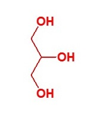

# Glycerin

Kommen wir zu einem weiteren Inhaltsstoff, der in einer Creme vorkommen kann, aber nicht muss. 
Wir haben schon in dem vorherigen Kapitel Glycerin erwähnt, aber nicht genau beschrieben. 
Der Aufbau beziehungsweise das Aussehen des Moleküls lässt sich aus dem vorher beschriebenen Fettmolekül ableiten, da
das Glycerin desselben Bestandteil ist. 
Vollständigkeitshalber ist in der folgenden Abbildung das Glycerinmolekül gezeigt.

Hiermit stellt das Glycerin das Grundgerüst sowohl von Fett- und Ölmolekülen als auch von Mono- und Diglyceriden dar. 
Das Fehlen der Fettsäurereste im Glycerinmolekül bewirkt, dass es ausschließlich Wasser und kein Fett anzieht. 
Diese Eigenschaft, das Wasser stark anzuziehen, gepaart mit der geringen Flüchtigkeit, 
bewirkt, dass das Glycerin das Wasser bindet und als Feuchthaltemittel dient, 
wenn es als Zusatzstoff in beispielsweise Lebensmitteln oder Kosmetika eingesetzt wird. 
Damit trocknen Lebensmittel oder auch Cremes nicht so schnell aus, wenn sie Glycerin enthalten. 
Im kosmetischen Bereich hat das Glycerin noch eine weitere Funktion, 
es macht die Haut weicher und lässt bestimmte Stoffe schneller in die Haut einziehen. 
Dies kann sich einerseits positiv auswirken, andererseits kann es bei empfindlichen Personen allergische Reaktionen begünstigen, 
da es andere allergieauslösende Stoffe schneller einziehen lässt. 
Nach aktuellen Erkenntnissen ist Glycerin selbst nicht allergen.