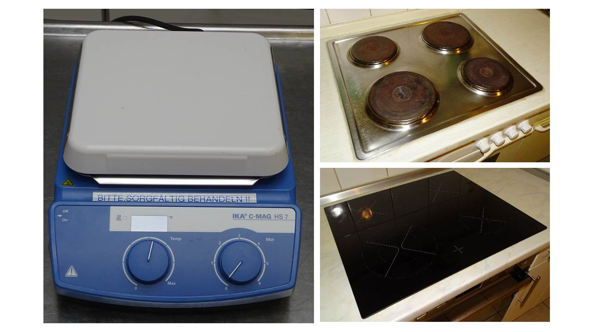
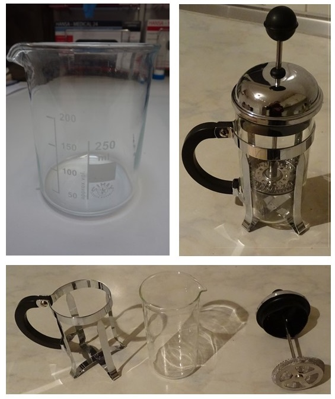
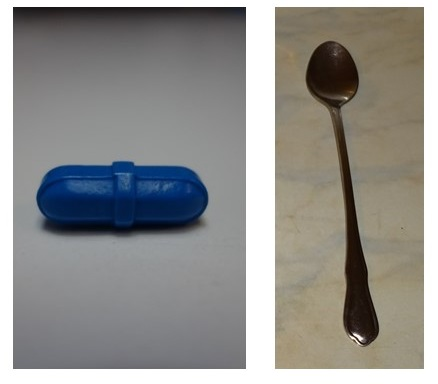

# Dein Labor

Genaugenommen entspricht das Labor in der Bioverfahrenstechnik einer ganz normalen Küche. Viele Werkzeuge, Gefäße, Apparate und sogar "Zutaten" haben eine Entsprechung. Im folgenden Abschnitt sollen diese Ähnlichkeiten aufgezeigt und besprochen werden.

Der magnetische Rührfisch und eine Heizplatte mit regelbarer Rührfunktion kommen
regelmäßig im Labor zum Einsatz, um Flüssigkeiten gut und kontinuierlich zu durchmischen.
Die Entsprechung findet man natürlich auch beim Kochen. Ob nun mit einem Schneebesen oder mit einem Löffel,
häufig müssen Suppen während des Erwärmens ständig gerührt werden um ein Anbrennen oder Siedeverzüge (Überkochen) zu verhindern.
Eine andere Aufgaben ist die Durchmischungen zweier flüssiger Phasen, wie z.B. Öl und Wasser beim Salatdressing.



  <video id="my-video" class="video-js" controls preload="auto" width="720" height="405"
  poster="./video/ruehren.png" data-setup="{}">
  <source src="./video/ruehren.mp4" type='video/mp4'>
  <source src="./video/ruehren.webm" type='video/webm'>
  

    To view this video please enable JavaScript, and consider upgrading to a web browser that
    <a href="http://videojs.com/html5-video-support/" target="_blank">supports HTML5 video</a>
  

  </video>
  



Videoverweis: <a href="https://collaborating.tuhh.de/Early-Bird-Betreuende/handcreme/raw/development/video/ruehren.mp4" target="_blank">https://collaborating.tuhh.de/Early-Bird-Betreuende/handcreme/raw/development/video/ruehren.mp4
</a>

#### Weitere Entsprechungen:

   - Protokoll / Rezept
   - Abzug / Dunstabzugshaube
   - Rührer / Handrührgerät
   - Bechergläser, Kolben, Standzylinder / Töpfe, Pfannen, Messbecher
   - Bunsenbrenner / Gasherd

  #### Was ist der Grund für die Formen der einzelnen Gefäße?
  Beispiel: Erlenmeyerkolben
