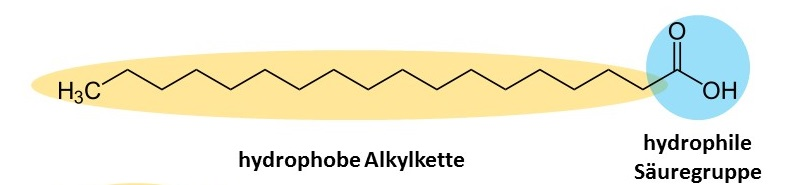
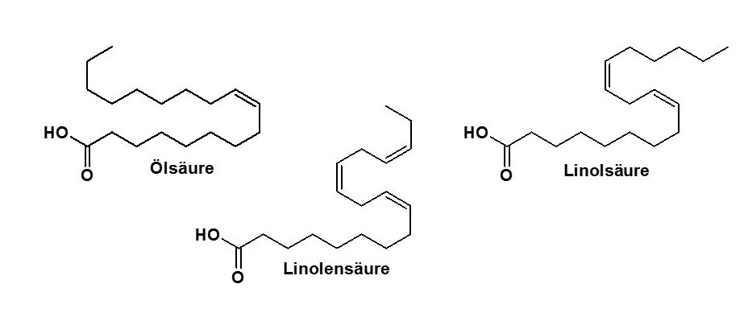

# Fettsäuren

Wie Du bei den Fetten und Ölen gelernt hast, sind diese dreifache Fettsäureester von Glycerin.

#### Was sind nun aber Fettsäuren? Und wie werden sie hergestellt oder gewonnen?

Fettsäuren werden zu den Lipiden und Tensiden gezählt. Lipide haben ihren Wortstamm
im Griechischen und werden als Fett übersetzt. Die Fettsäuren sind molekulare Teile von
Fetten und können aus diesen hergestellt werden. Fettsäuren mischen sich aber ebenso nicht mit Wasser.
Tenside sind allgemein aus einem hydrophoben („wasserabweisenden“)
Teil und einem hydrophilen („wasserliebenden“) Teil aufgebaut.
Bei der Fettsäure ist dies die hydrophile Säuregruppe (in Abbildung 1 der blaue Teil)
und die wasserabweisenden Alkylkette (in Abbildung 1 der gelbe Teil).

Die Alkylkette ist im gezeigten Beispiel in Abbildung 1 eine lange Aneinanderreihung von CH2 Gruppen.
Die Anzahl der enthaltenen Kohlenstoffatome (C-Atome) ist bei den in der Natur
vorkommenden Fettsäuren größtenteils gerade. Also 12, 14, 16, 18 und so weiter.
Die Fettsäuren werden häufig mit Trivialnamen bezeichnet. In Abbildung 2 sind beispielhaft
drei Fettsäuren und deren Bezeichnung gezeigt.

Die Länge dieser Alkylkette hat einen Einfluss auf den Schmelzpunkt der Fettsäure.
Je länger die Kette desto höher der Schmelzpunkt der Fettsäure.
Des Weiteren können Doppelbindungen in der Alkylkette vorhanden sein,
wie in den drei Beispielen in Abbildung 2 gezeigt. Je mehr Doppelbindungen in der
Kohlenstoffkette vorhanden sind desto niedriger ist der Schmelzpunkt der Fettsäure.
Da [Fette und Öle](./FetteOele.md) ein dreifacher Ester des Glycerin mit Fettsäuren ist,
beeinflusst die Fettsäurezusammensetzung der Triglycinester auch den Zustand, in welchem die
Fette oder Öle bei Raumtemperatur vorliegen.

Fettsäuren sind auch in Handcreme enthalten und stabilisieren unter anderem
die fein verteilte Mischung (Emulsion) von sonst nicht mischbaren hydrophilen und
hydrophoben Inhaltsstoffen.
