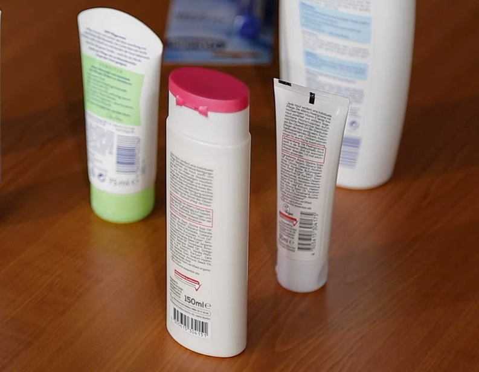

# Verbraucherinformation

#### Wieso ist es wichtig, sich mit Kosmetik einmal intensiver auseinander zu setzen?

Mit Kosmetik kommen wir täglich in Berührung. Wir alle haben mindestens eine Creme oder Lotion zu Hause im Schrank stehen.
Doch obwohl wir täglich Kosmetika (z.B. Handcreme) nutzen, beschäftigen wir uns selten mit unseren Kosmetikprodukten,
welches wir wirklich auf unseren Körper streichen. Kennen wir die Zusammensetzung bzw. Inhaltsstoffe? Können wir die verschiedenen Deklarationsformen auf den kosmetischen Produkten entschlüsseln?
Und wissen wir eigentlich, welche Bedeutung hinter all den verschiedenen Siegeln steckt?
Vermutlich nicht. Doch es ist wichtig kosmetische Produkte reflektiert und eigenständig bewerten zu können, daher einmal von Anfang an....

#### Wo hat Kosmetik ihren Ursprung?

Kosmetische Mittel hatten ihren Ursprung lange vor unserer Zeit.
Die Vorläufer waren Kohle und pulverisierte Steine, die damals mit Bienenwachs und Öl vermengt waren.[^1] Bis in die dreißiger Jahre des zwanzigsten Jahrhunderts
wurde Kosmetik zu Hause selber zusammen gerührt und die Rezepte über Generationen weitergereicht.
Auch Kosmetika, die vertrieben werden sollten, wurden in der heimischen Küche zusammen gemixt und an Türen verkauft.[^1]
Seit Juli 1976 gibt es die strenge Kosmetikrichtlinie, an die sich Hersteller der Kosmetikindustrie zu halten haben.
Diese wurde bis heute immer wieder angepasst, allerdings haben diese konsolidierten
Fassungen ausschließlich dokumentarischen Charakter.[^2]
Die Richtlinie definiert unter anderem die Stoffe, welche in kosmetischen Erzeugnissen nicht
verwendet werden dürfen, ferner werden zugelassene Farbstoffe, Konservierungsstoffe und UV-Filter aufgelistet.
Darüber hinaus ist die Etikettierung streng festgelegt. Diese muss lesbar und deutlich
sichtbar sein und diverse Angaben, wie z.B. die Liste der Inhaltsstoffe,
den Namen und die Anschrift des Herstellers und „den Nenninhalt zur Zeit
der Abfüllung als Gewichts- oder Volumenangabe“ [^2] enthalten. Ergänzend geht
die Richtlinie gegen Tierversuche mittels zweier Verbote vor.
Zum einen sind Tests kosmetischer Fertigerzeugnisse und Bestandteile an Tieren untersagt,
zum anderen „das Inverkehrbringen von kosmetischen Fertigerzeugnissen und Bestandteilen, die anhand von Tierversuchen getestet wurden“ [^2].

#### Interesse geweckt?

Die vorangegangenen Informationen waren ein Anstoß, um sich einmal intensiver mit den Inhaltsstoffen, dem Siegel und der Etikettierung von Kosmetik auseinanderzusetzen.
Dann sind hier weitere Informationen: www.haut.de, www.codecheck.info, „Verbraucherzentrale Bundesverband“, „Verbraucherzentrale Hamburg“, „Stiftung Warentest“, „Stiftung Ökotest“

[^1]: P. Underhill, *Was Frauen wollen: Warum sie kaufen, was sie kaufen*, Campus Verlag GmbH, (2014)

[^2]: Kosmetikrichtlinie - Richtlinie 76/768/EWG des Rates zur Angleichung der Rechtsvorschriften der Mitgliedstaaten über kosmetische Mittel, EUR-Lex 2011, [http://eur-lex.europa.eu/legal-content/DE/TXT/?uri=URISERV%3Al21191, Zurgriff 24.03.2017](http://eur-lex.europa.eu/legal-content/DE/TXT/?uri=URISERV%3Al21191)
