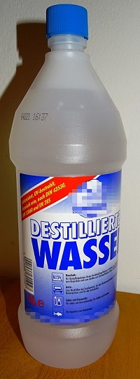

# Wasser

## Die Rolle von Wasser in Handcreme

Wie schon erwähnt ist Handcreme ein Gemisch aus wässrigen und öligen Inhaltsstoffen.
Die Haut ist die äußere Schicht unseres Köpers und schützt uns vor allem Umgebenden.
Genau wie sonst im Körper viel Wasser enthalten ist, hat Haut auch einen hohen Anteil an Wasser.
So machen 72% des Gewichts von Haut das enthaltene Wasser aus, und 25% des Wassers in unserem Körper sind in unserer Haut gespeichert.
Aus diesen Gründen ist in Handcreme ein Hauptbestandteil Wasser (Aqua).
Hierdurch soll der Haut Feuchtigkeit zugeführt werden.  

## Wasser und Wasserhärte

Beschäftigen wir uns etwas näher mit Wasser. Wasser ist überlebenswichtig für uns.
Die Qualität und die Reinheit von Wasser sind für Trinkwasser sehr wichtig und sind in manchen Erdteilen nicht immer gewährleistet.
Vom Trinken von Leitungswasser wird schon in manchen Ländern im europäischen Ausland abgeraten.
Hierzulande ist die Trinkwasserqualität von Leitungswasser nahezu überall gegeben.
Doch unterscheidet sich das Trinkwasser deutlich von Region zu Region im Gehalt von löslichen Salzen (Ionen).
Dies wird über die unterschiedliche Wasserhärte in den verschiedenen Regionen deutlich.
So enthält auch Mineralwasser aus dem Supermarkt verschiedene Salze, welche als Menge enthaltener Ionen auf dem Etikett angegeben sind.
Hier findet man den Gehalt von Natrium-, Calcium- und Magnesiumionen und die damit verbundene Menge von Chlorid, Sulfat und Hydrogencarbonat.
Reines Wasser oder auch destilliertes Wasser enthält nahezu keine Ionen oder andere gelöste Stoffe und ist somit nur noch reines Wasser.

## Destilliertes Wasser

#### Was ist jetzt aber destilliertes Wasser genau und wozu wird es benutzt?

Klassisch wird destilliertes Wasser durch Verdampfen und Kondensieren hergestellt
und darf nur dann als destilliertes Wasser bezeichnet werden.
Bei diesem Prozess, der auch in jeder Küche beim Kochen stattfindet, wird das Wasser von verschiedensten Stoffen gereinigt.
Dies können, wie schon oben erwähnt, im Wasser gelöste Salze oder auch organische Substanzen sein,
soweit diese entweder leicht flüchtiger oder schwer flüchtiger als Wasser sind.

#### Warum ist es wichtig möglichst sauberes Wasser zum Herstellen einer Creme zu verwenden?

Viele unterschiedliche im Leitungswasser gelöste Stoffe können mit anderen Komponenten
der Creme wechselwirken und teilweise stören oder die Herstellung einer Creme komplett verhindern.
Darum ist es besser möglichst reines, von Salzen und anderen Stoffen befreites Wasser zu benutzen.
